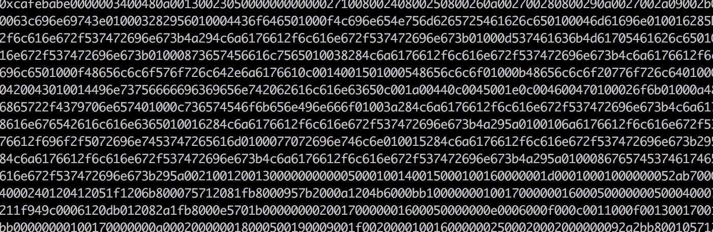
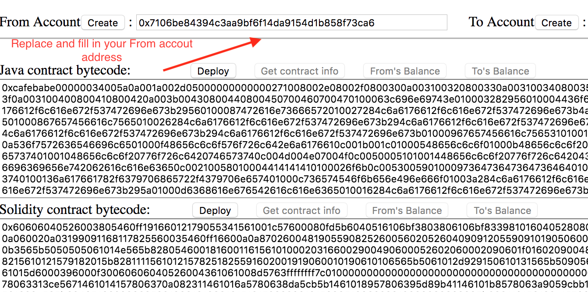
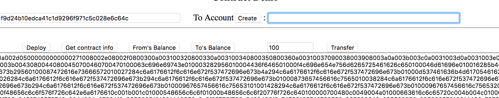
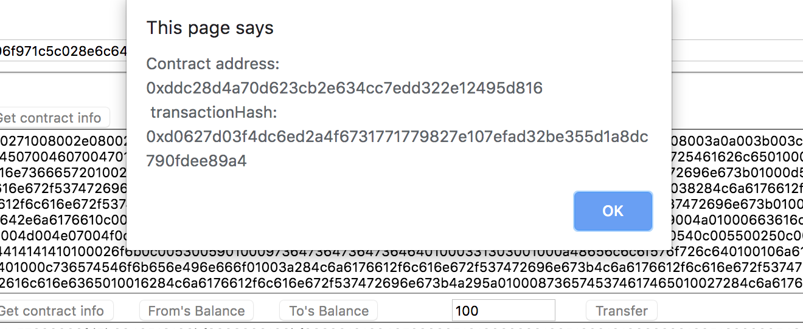
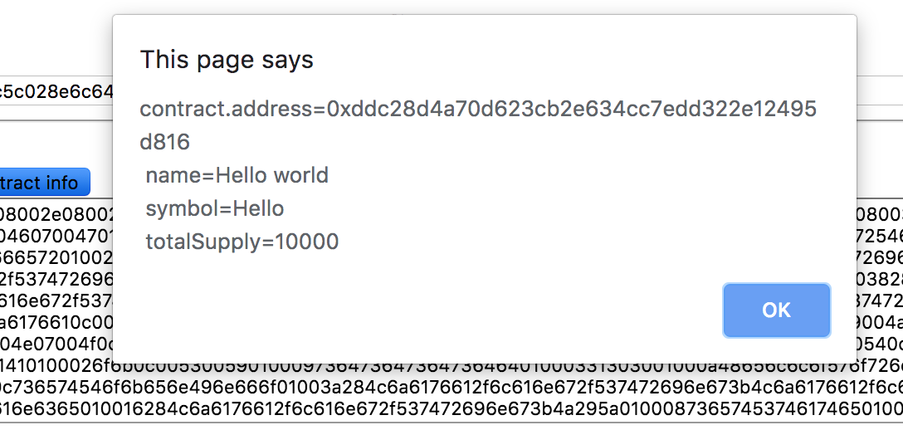
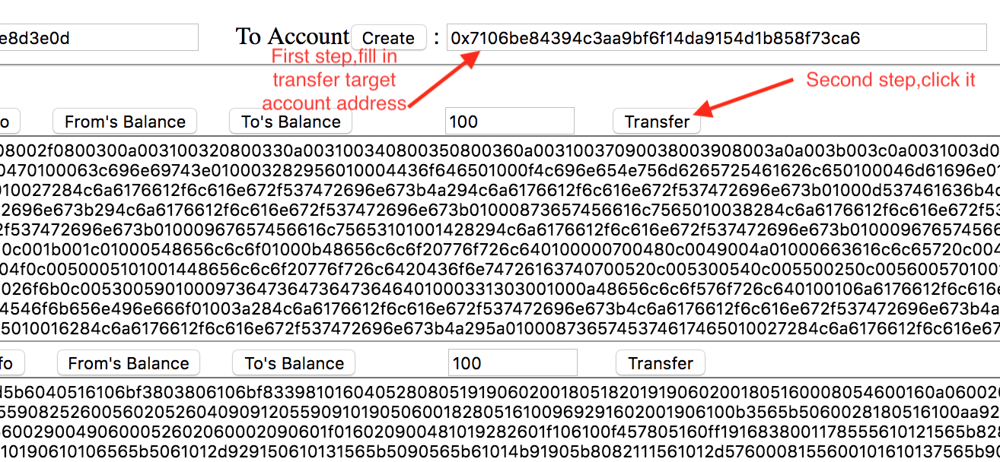
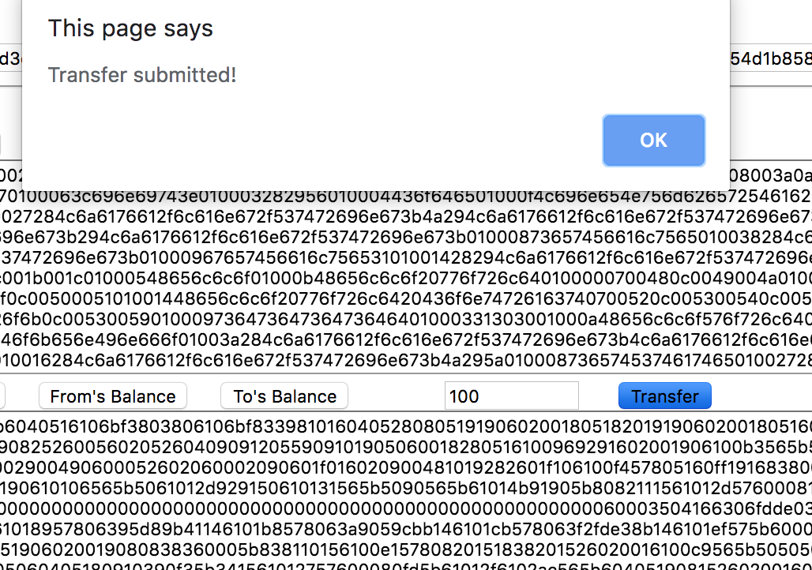
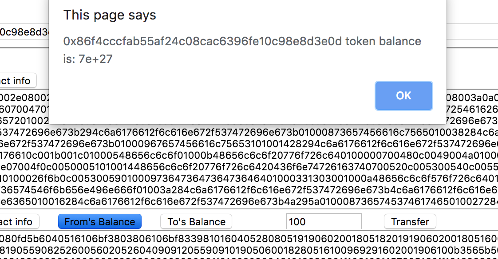
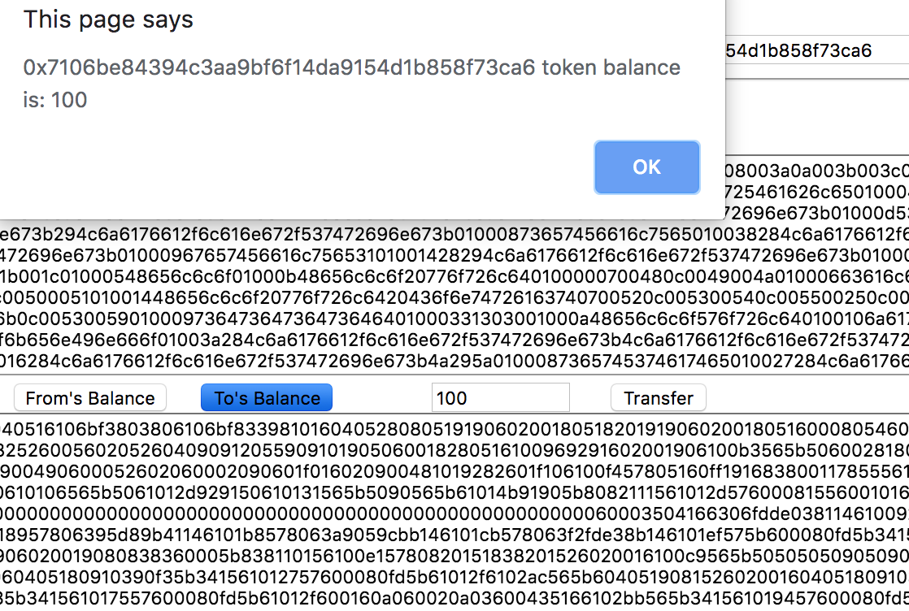

# Cypherium Java Smart Contract Tutorial

## Run your cypher Node accord to the README file begin
[CypherTestBin](https://github.com/cypherium/CypherTestBin/blob/master/README.md) Tutorial for run cypher Node

## Environmental configuration

Cypherium’s Java Smart Contract system need JDK1.8 support.So Please install JDK1.8. To learn how to configure the environment of JDK1.8, refer to Java’s online literature.

After you have configured your JDK environment, execute javac --version in the Console environment to confirm whether it is 1.8.xxx

```
$​ javac -version 
javac 1.8.xxx
```
Download repository

 ```
  $​git clone https://github.com/cypherium/ContractExample.git
  $​cd ContractExample
 ```

## Write and Compile smart contract

Firstly, we can create one simple HelloWorld smart contract as follows:

```
import​ javax.cypher.Cypnet; 
public​ class HelloWorld {
    public​ ​static​ ​void​ main(​String​[] args) {
        //We create a token with a total circulation of 10,000 // The symbol is Hello and the name is Hello world 
        long​ totalSupply = ​10000​;
        //All the issued tokens to the creator
        Cypnet.setTokenInfo(​"Hello"​, ​"Hello world"​, totalSupply, ​""​); 
        Cypnet.changeBalance(​"caller"​, totalSupply);
        System.out.​println​(​"Hello"​); 
    }

    public​ ​static​ ​String​ ​transfer​(​String​ _to, ​long​ _value) { 
        long​ n = Cypnet.balanceOf(​"caller"​);
        if​ (n < _value) {
            //throw new Exception("Insufficient balance");
        ​   return​ ​"Insufficient balance"​;
        }
        Cypnet.​transfer​(​"caller"​, _to, _value);
        return​ null;
    }
    public​ ​static​ ​String​ getValue(​String​ skey) {
        String​ s = Cypnet.getState(skey);
        return​ s;
    }
    public​ ​static​ ​String​ setValue(​String​ skey, ​String​ sValue) {
        Cypnet.setState(skey, sValue); return​ ​"ok"​;
    }
}    
```

Compile HelloWorld.java and execute the following command:

```
$ cd ContractExample/src
$​ javac -cp ./jdk/classes HelloWorld.java
```

A HelloWorld.class will be generated in the current directory.

## Deploy your smart contract

In order to deploy your newly generated `HelloWorld.class` on the Cypherium blockchain network, you need to convert the binary file into string format. We provide one file2str tool to complete this step (similar tools on the network are also available):

We provide executable files for Linux, Mac, and Windows platforms, and users can select the target type according to your OS systems.

### Generate string format
Suppose you local at `src` folder and you OS are linux,Below is the usage:

```
$​ ../file2str/linux/file2str HelloWorld.class
```



### Prepare tow account address
Please approve your CypherBin node (VPS node or public machine node) has tow accounts by using `cph.accounts` check this.If not,your creat enough account by command `personal.newAccount()` function.
Also you should approve one of your account balance is not 0.

### Edit the `index.html` file on your local computer which can run google chrome browser.
Change the node ip value and account password value
```
 web3.setProvider(​new web3​.providers.HttpProvider(​"http://54.244.144.111:18002"​));
```
The ip "54.244.144.111" please replace it by your VPS node or public machine  node's external ip.
*  Change the accPasswd which it's default value is `cypher2019test` according to your node's account password which created before:
 ```
 var accPasswd = "cypher2019test";
 ```
### Deploy by using index.html tool
After the Prepare is completed, open the `index.html` deploy tool with google chrome browser,as shown below:


The Java contract and Solidity contract bytecode is auto fill in blank. `From address` should fill in one of your account which have enough balance,`To address` fill in another account or reserved:
  
Finally clicking the `Deploy` button will prompt message info indicate the execution is successful, as shown below:  



## Execute smart contract

After deploying the HelloWorld Smart Contract according to the above diagram, you can click `Get contract info`, `From's Balance`, `To's Balance`, `Transfer` to perform related smart contract executions.
### Get contract info  

### Transfer、From's Balance、To's Balance  
  #### Firstly,Fill in target account address  
  
  #### Secondly,Transfer Balance  
  You can define the cph coin number which will be transfered.Then click the `Transfer` button:
    

  #### Thirdly,Check the Balance
  Before check balance,Please check your node's TxBlockNumber and KeyBlockNumber must be syn highest.
   ##### From account Balance
   
   ##### To account Balance
   

## Smart contracts​ ​development

Smart contracts are divided into token smart contracts and general smart contracts.

The Cypherium token smart contract follows the Ethereum ERC20 standard and requires the following fixed structure:

```
import​ javax.cypher.Cypnet; ​//reference the library under jdk / classes 
public​ ​class​ ​HelloWorld​ {
    ​public​ ​static​ ​void​ ​main​(String[] args) { ​//Token execution entry function 
        ​//Set the symbol, name, total supply, token owner information of the token
        Cypnet.setTokenInfo(​"Hello"​, ​"Hello world"​, totalSupply, ​""​); 
    }

    ​//Transfer trigger function, this function can be triggered automatically when the client transfers token
    ​public​ ​static​ String ​transfer​(String _to, ​long​ _value) {} 
}
```
## javax.cypher.Cypnet library
In addition, we also provide the following functions in the javax.cypher.Cypnet library.

### Get the account balance
```
public​ ​static​ ​native​ ​long​ ​BalanceOf​(String paramString);
```

### Change the account balance
```
public​ ​static​ ​native​ ​boolean​ ​ChangeBalance​(String paramString, ​long​ paramLong);
```

### Get key-value
```
 public​ ​static​ ​native​ ​boolean​ GetState(​String​ paramString1, ​String​ paramString2, byte​[] paramArrayOfByte);
```

### Set key-value
```
 public​ ​static​ ​native​ ​boolean​ SetState(​String​ paramString1, ​String​ paramString2, byte​[] paramArrayOfByte);
```

We provide support for most JDK1.8 libraries in jdk/classes, and you may design smart contracts in accordance with traditional Java programs.


