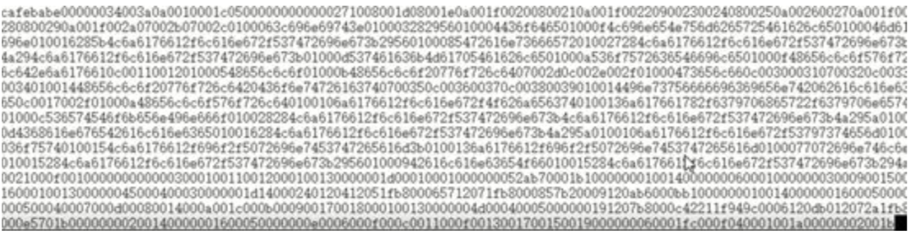
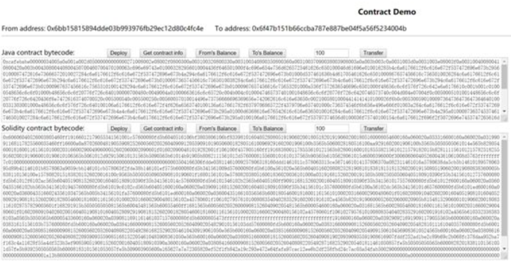

# Cypherium Java Smart Contract Tutorial

## Environmental configuration
As Cypherium’s Java Smart Contract system supports JDK1.8, the development environment of JDK1.8 is required first before you may start developing. To learn how to configure the environment of JDK1.8, refer to Java’s online literature.

After you have configured your JDK environment, execute javac --version in the Console environment to confirm whether it is 1.8.xxx

```
$​ javac -version 
javac 1.8.xxx
```

In addition to completing the Java environment configuration, make sure you have configured the Cypherium smart contract JDK library.

This step is very simple: just create a folder labeled “jdk/classes” in the current working directory, then download the following directory.

https://github.com/cypherium/ContractExample/tree/master/client/jdk/classes


to jdk/classes.

In particular, since the java class file is cross-platform, the directory file can be used regardless of whether the client system is Linux, Mac, or Windows.

## Compilation of smart contracts
First, we can create a simple HelloWorld smart contract as follows:

```
import​ javax.cypher.Cypnet; 
public​ class HelloWorld {
    public​ ​static​ ​void​ main(​String​[] args) {
        //We create a token with a total circulation of 10,000 // The symbol is Hello and the name is Hello world 
        long​ totalSupply = ​10000​;
        //All the issued tokens to the creator
        Cypnet.setTokenInfo(​"Hello"​, ​"Hello world"​, totalSupply, ​""​); 
        Cypnet.changeBalance(​"caller"​, totalSupply);
        System.out.​println​(​"Hello"​); 
    }

    public​ ​static​ ​String​ ​transfer​(​String​ _to, ​long​ _value) { 
        long​ n = Cypnet.balanceOf(​"caller"​);
        if​ (n < _value) {
            //throw new Exception("Insufficient balance");
        ​   return​ ​"Insufficient balance"​;
        }
        Cypnet.​transfer​(​"caller"​, _to, _value);
        return​ null;
    }
    public​ ​static​ ​String​ getValue(​String​ skey) {
        String​ s = Cypnet.getState(skey);
        return​ s;
    }
    public​ ​static​ ​String​ setValue(​String​ skey, ​String​ sValue) {
        Cypnet.setState(skey, sValue); return​ ​"ok"​;
    }
}    
```

Compile HelloWorld.java and execute the following command:

```
$​ javac -cp ./jdk/classes HelloWorld.java
```

A HelloWorld.class will be generated in the current directory.

## Publish your smart contract
In order to publish our newly generated HelloWorld.class on the Cypherium blockchain network, we also need to convert the binary file into a string. We provide a file2str tool to complete this step (similar tools on the network are also available):
https://github.com/cypherium/ContractExample/tree/master/file2str

We provide executable files for Linux, Mac, and Windows platforms, and users can download them according to their own operating systems.

Execute in the current directory

```
$​ file2str HelloWorld.class
```



Download two files:

https://github.com/cypherium/ContractExample/blob/master/src/index.html

https://github.com/cypherium/ContractExample/blob/master/src/web3.js

to the current directory and open them with a text file editor, Change the blockchain node settings section
```
 web3.setProvider(​new web3​.providers.HttpProvider(​"http://54.244.144.111:8000"​));
```

And address setting section
```
 var​ sFrom = ​"0x6bb15815894dde03b993976fb29ec12d80c4fc4e"​; var​ sTo = ​"0x6f47b151b66ccba787e887be04f5a56f5234004b"​;
```
To your blockchain node and address. Note that the sFrom address must have a balance of more than one CPH, otherwise the deployment will fail.
After the modification is complete, open the webpage with a local browser. It is recommended that you use the Chrome browser, as shown below:



Copy the results of file2str HelloWorld.class to the text box under the Java contract bytecode. Clicking the [Deploy] button will prompt whether the execution is successful, as shown below:


If an error is reported, make sure to double check your work up to this point to find your error.

## Execute smart contract
After deploying the HelloWorld Smart Contract according to the above diagram, you can click [Get contract info], [From's Balance], [To's Balance], [Transfer] to perform related smart contract executions.

## Smart contracts​ ​development
Smart contracts are divided into token smart contracts and general smart contracts.

The Cypherium token smart contract follows the Ethereum ERC20 standard and requires the following fixed structure:

```
import​ javax.cypher.Cypnet; ​//reference the library under jdk / classes 
public​ ​class​ ​HelloWorld​ {
    ​public​ ​static​ ​void​ ​main​(String[] args) { ​//Token execution entry function 
        ​//Set the symbol, name, total supply, token owner information of the token
        Cypnet.setTokenInfo(​"Hello"​, ​"Hello world"​, totalSupply, ​""​); 
    }

    ​//Transfer trigger function, this function can be triggered automatically when the client transfers token
    ​public​ ​static​ String ​transfer​(String _to, ​long​ _value) {} 
}
```

In addition, we also provide the following functions in the javax.cypher.Cypnet library.

## Get the account balance
```
public​ ​static​ ​native​ ​long​ ​BalanceOf​(String paramString);
```

## Change the account balance
```
public​ ​static​ ​native​ ​boolean​ ​ChangeBalance​(String paramString, ​long​ paramLong);
```

## Get key-value
```
 public​ ​static​ ​native​ ​boolean​ GetState(​String​ paramString1, ​String​ paramString2, byte​[] paramArrayOfByte);
```

## Set key-value
```
 public​ ​static​ ​native​ ​boolean​ SetState(​String​ paramString1, ​String​ paramString2, byte​[] paramArrayOfByte);
```

We provide support for most JDK1.8 libraries in jdk/classes, and you may design smart contracts in accordance with traditional Java programs.

